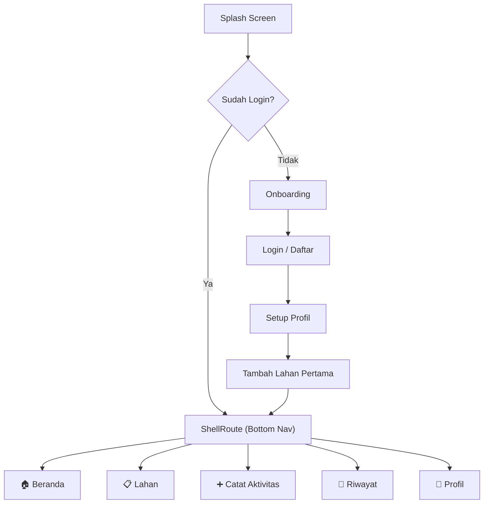
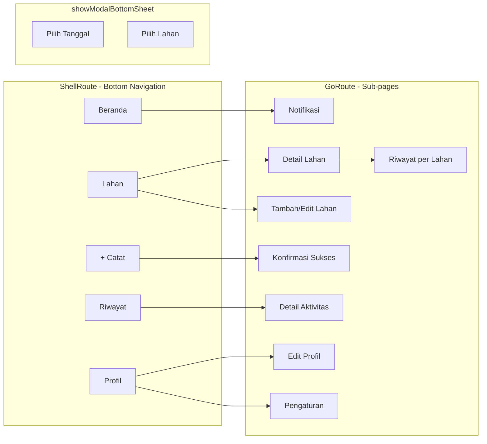
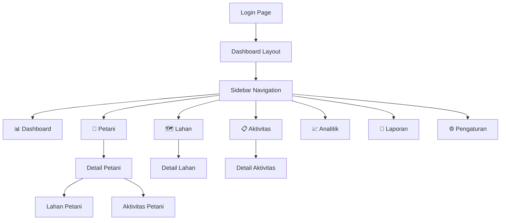

# 🌾 Peta Tani — Frontend Implementation Plan

## Ringkasan

Dokumen ini berisi perencanaan frontend untuk aplikasi **Peta Tani** yang terdiri dari:
1. **Mobile App (Petani)** — Flutter (Material 3 + GetWidget)
2. **Web Dashboard (Admin)** — Next.js + Ant Design

### ✅ Keputusan yang Sudah Disetujui

| Keputusan | Pilihan |
|-----------|--------|
| **Tech Stack Mobile** | Flutter — widget built-in terlengkap (Material 3 + Cupertino + GetWidget 1000+ komponen) |
| **Tech Stack Web** | Next.js + Ant Design — 60+ komponen enterprise siap pakai |
| **Bahasa UI** | Bahasa Indonesia sepenuhnya |
| **Offline Mode** | Ditunda ke iterasi kedua (bukan MVP) |
| **Auth** | Nomor HP + OTP (via Firebase Auth) |
| **Backend** | Firebase (Auth + Firestore + Cloud Functions) |
| **Target Device** | Android low-end — animasi minimal, APK ringan |

---

## 1. Tech Stack

| Layer | Mobile (Petani) | Web (Admin) |
|-------|----------------|-------------|
| **Framework** | Flutter 3.x | Next.js 15 (App Router) |
| **Language** | Dart | TypeScript |
| **Navigation** | GoRouter (declarative) | Next.js App Router |
| **Styling** | Material 3 ThemeData | Ant Design Token System |
| **UI Components** | Material 3 + GetWidget | Ant Design (60+ komponen) |
| **State** | Riverpod | Zustand + TanStack Query |
| **Charts** | fl_chart | Ant Design Charts (@ant-design/charts) |
| **Forms** | Flutter Form + custom validators | Ant Design Form |
| **HTTP** | Dio | Axios + TanStack Query |
| **Icons** | Material Icons + Cupertino | Ant Design Icons |
| **Auth** | Firebase Auth (Phone OTP) | Firebase Auth (Email/Password) |
| **Database** | Cloud Firestore | Cloud Firestore |
| **Backend** | Firebase Cloud Functions | Firebase Cloud Functions |
| **Storage** | Firebase Storage | Firebase Storage |

> [!NOTE]
> **Mengapa Flutter?** Widget built-in paling lengkap di pasar cross-platform. Material 3 + Cupertino tersedia langsung tanpa library tambahan. Ditambah GetWidget untuk 1000+ komponen siap pakai.
>
> **Mengapa Ant Design?** Komponen enterprise terlengkap (Table, Form, DatePicker, Cascader, Tree, dll) — ideal untuk dashboard admin yang data-heavy. Built-in i18n support untuk Bahasa Indonesia.

> [!WARNING]
> **Optimasi Android Low-End** — Target device adalah Android low-end (RAM ≤ 2GB, prosesor entry-level). Implikasinya:
> - Hindari animasi kompleks (gunakan `AnimationController` dengan durasi pendek)
> - Lazy loading untuk list panjang (`ListView.builder`)
> - Hindari `BoxShadow` berlebihan (berat di GPU)
> - Target APK size < 20MB
> - Gunakan `const` constructor di mana pun bisa
> - Image compression sebelum upload ke Firebase Storage

---

## 2. Design System

### 2.1 Color Palette

Warna dipilih untuk **kontras tinggi di bawah sinar matahari** (rasio kontras ≥ 7:1).

```
Primary       : #2D6A4F (hijau tani — deep green)
Primary Light : #40916C
Primary Dark  : #1B4332
Secondary     : #D4A373 (tanah/coklat warm)
Accent        : #E76F51 (oranye — untuk CTA & alert)
Background    : #FEFAE0 (krem hangat — nyaman di mata)
Surface       : #FFFFFF
Text Primary  : #1A1A2E (hampir hitam)
Text Secondary: #6B7280
Success       : #2D6A4F
Warning       : #E9C46A
Error         : #E63946
```

**Admin Web** menggunakan **dark mode** sebagai default:
```
BG Dark       : #0F172A (slate-900)
Surface Dark  : #1E293B (slate-800)
Border Dark   : #334155 (slate-700)
Text Dark     : #F8FAFC
Accent Admin  : #22D3EE (cyan untuk highlight)
```

### 2.2 Typography

| Elemen | Mobile (Flutter) | Web (Ant Design) |
|--------|-----------------|------------------|
| Font | Google Fonts: Inter | Inter (via Google Fonts CDN) |
| Heading | 20-28sp, FontWeight.bold | 24-36px, Bold |
| Body | 16sp, FontWeight.normal | 14-16px, Regular |
| Caption | 12-14sp | 12px |
| Button | 16sp, FontWeight.w600 | 14px, Medium |

> [!TIP]
> Minimum touch target: **48x48dp** untuk mobile (petani pakai tangan kotor/sarung tangan).

### 2.3 Spacing & Layout

- Base unit: **8px**
- Padding card: 16px
- Gap antar elemen: 12-16px
- Border radius: 12px (card), 8px (button), 24px (chip)

### 2.4 Iconography

Mobile: **Material Icons** (built-in Flutter) + **Cupertino Icons**. Web: **Ant Design Icons**.
Ukuran minimum 24dp di mobile. Setiap jenis aktivitas punya ikon unik:

| Aktivitas | Material Icon | Emoji Fallback |
|-----------|--------------|----------------|
| Olah Tanah | `Icons.agriculture` | 🪓 |
| Semai | `Icons.eco` | 🌱 |
| Pupuk | `Icons.science` | 💧 |
| Penyiraman | `Icons.water_drop` | 🚿 |
| Panen | `Icons.grass` | 🌾 |
| Pengendalian Hama | `Icons.shield` | 🛡️ |

---

## 3. Mobile App — Navigasi & Screens

### 3.1 Navigation Structure (GoRouter)



**Bottom Tab Bar** (5 tab, posisi bawah layar):

| Tab | Label | Ikon | Deskripsi |
|-----|-------|------|-----------|
| 1 | Beranda | Home | Dashboard ringkasan |
| 2 | Lahan | Map | Daftar & kelola lahan |
| 3 | **+ Catat** | PlusCircle | **FAB besar di tengah** — input aktivitas |
| 4 | Riwayat | Clock | Timeline aktivitas |
| 5 | Profil | User | Pengaturan & profil |

> [!TIP]
> Tab "**+ Catat**" dibuat menonjol (FAB style, warna accent `#E76F51`) karena ini **jantung app** — harus bisa diakses dalam 1 tap.

### 3.2 Screen Details

#### A. Onboarding (3 slide)

```
┌─────────────────────┐
│                     │
│    [Ilustrasi]      │
│                     │
│  Catat aktivitas    │
│  pertanian Anda     │
│  dengan mudah       │
│                     │
│   ● ○ ○             │
│                     │
│  [ Mulai Sekarang ] │
│  [ Lewati ]         │
└─────────────────────┘
```

- Slide 1: "Catat aktivitas pertanian Anda"
- Slide 2: "Pantau perkembangan tanaman"
- Slide 3: "Dapat pengingat jadwal"

#### B. Login / Daftar (Firebase OTP)

```
┌─────────────────────┐
│    🌾 Peta Tani     │
│                     │
│  Masuk dengan       │
│  nomor HP Anda      │
│                     │
│  ┌─────────────────┐│
│  │ +62 8xx xxxx    ││
│  └─────────────────┘│
│                     │
│  [ Kirim Kode OTP] │
└─────────────────────┘

┌─────────────────────┐  (screen 2)
│    Verifikasi OTP   │
│                     │
│  Kode dikirim ke    │
│  +62 812-xxxx-xxxx  │
│                     │
│  ┌──┐┌──┐┌──┐┌──┐  │
│  │  ││  ││  ││  │  │
│  └──┘└──┘└──┘└──┘  │
│                     │
│  Kirim ulang (30d)  │
│  [ Verifikasi    ]  │
└─────────────────────┘
```

> Login via Firebase Auth Phone → OTP otomatis terdeteksi (auto-read SMS)

#### C. Beranda (Home)

```
┌─────────────────────┐
│ Selamat pagi, Pak 👋│
│ Sabtu, 3 Mei 2026   │
│─────────────────────│
│ ┌─────┐ ┌─────┐    │
│ │ 3   │ │ 12  │    │
│ │Lahan│ │Aktv │    │
│ └─────┘ └─────┘    │
│─────────────────────│
│ 📋 Pengingat Hari Ini│
│ ┌───────────────────┐│
│ │ 🧪 Pupuk - Sawah A││
│ │    Jadwal: 08:00  ││
│ └───────────────────┘│
│─────────────────────│
│ 🕐 Aktivitas Terakhir│
│ ┌───────────────────┐│
│ │ 🌱 Semai - Sawah B││
│ │    Kemarin, 14:30 ││
│ └───────────────────┘│
│─────────────────────│
│ [🏠] [📋] [➕] [📅] [👤]│
└─────────────────────┘
```

**Komponen:**
- Greeting header + tanggal
- Stats card (jumlah lahan, total aktivitas bulan ini)
- Reminder card (pengingat hari ini)
- Recent activity list (3 aktivitas terakhir)

#### D. Daftar Lahan

```
┌─────────────────────┐
│ Lahan Saya          │
│─────────────────────│
│ ┌───────────────────┐│
│ │ 🌾 Sawah Belakang ││
│ │ Padi • 2 Ha       ││
│ │ Tanam: 15 Mar 2026││
│ │ Fase: Vegetatif   ││
│ └───────────────────┘│
│ ┌───────────────────┐│
│ │ 🌽 Kebun Atas     ││
│ │ Jagung • 0.5 Ha   ││
│ │ Tanam: 1 Apr 2026 ││
│ │ Fase: Generatif   ││
│ └───────────────────┘│
│                     │
│         [+ Tambah]  │
│─────────────────────│
│ [🏠] [📋] [➕] [📅] [👤]│
└─────────────────────┘
```

- Tap card → Detail Lahan (stack navigation)
- Swipe kiri → Edit / Hapus
- FAB "Tambah Lahan" di kanan bawah

#### E. Input Aktivitas ⭐ (Core Screen)

```
┌─────────────────────┐
│ ← Catat Aktivitas   │
│─────────────────────│
│ Pilih Lahan:        │
│ [▼ Sawah Belakang ] │
│                     │
│ Jenis Aktivitas:    │
│ ┌────┐┌────┐┌────┐ │
│ │🪓  ││🌱  ││💧  │ │
│ │Olah││Sema││Pupu│ │
│ └────┘└────┘└────┘ │
│ ┌────┐┌────┐┌────┐ │
│ │🚿  ││🛡️  ││🌾  │ │
│ │Sira││Hama││Pane│ │
│ └────┘└────┘└────┘ │
│                     │
│ Tanggal:            │
│ [📅 3 Mei 2026    ] │
│                     │
│ Catatan:            │
│ ┌───────────────────┐│
│ │ Pupuk urea 50kg  ││
│ └───────────────────┘│
│                     │
│ Jumlah (opsional):  │
│ [ 50 ] [▼ kg ]      │
│                     │
│ [   💾 SIMPAN     ] │
└─────────────────────┘
```

**UX Flow:**
1. Pilih lahan (dropdown, default = lahan terakhir)
2. Tap jenis aktivitas (grid icon, single select)
3. Tanggal (default hari ini, bisa ubah)
4. Catatan (free text, opsional)
5. Jumlah + satuan (opsional)
6. **SIMPAN** → animasi sukses → kembali ke Beranda

> [!IMPORTANT]
> Screen ini harus bisa diselesaikan dalam **< 30 detik**. Minimal input, banyak default.

#### F. Riwayat / Timeline

```
┌─────────────────────┐
│ Riwayat             │
│ [▼ Semua Lahan    ] │
│─────────────────────│
│ ── Mei 2026 ──────  │
│ │                   │
│ ● 3 Mei             │
│ │ 💧 Pemupukan      │
│ │ Sawah Belakang    │
│ │                   │
│ ● 1 Mei             │
│ │ 🌱 Penyemaian     │
│ │ Kebun Atas        │
│ │                   │
│ ── Apr 2026 ──────  │
│ │                   │
│ ● 28 Apr            │
│ │ 🪓 Olah Tanah     │
│ │ Sawah Belakang    │
│─────────────────────│
│ [🏠] [📋] [➕] [📅] [👤]│
└─────────────────────┘
```

- Vertical timeline, grouped by bulan
- Filter by lahan (dropdown atas)
- Tap item → detail aktivitas
- Infinite scroll / pagination

#### G. Profil

- Nama, nomor HP, foto (opsional)
- Pengaturan notifikasi
- Bantuan / FAQ
- Tentang Aplikasi
- Logout

### 3.3 Mobile Navigation Map



**Kedalaman navigasi maksimal: 3 level** (Tab → Detail → Sub-detail)

---

## 4. Admin Web — Navigasi & Screens

### 4.1 Navigation Structure



**Sidebar Navigation** (collapsible, selalu terlihat):

| Menu | Path | Deskripsi |
|------|------|-----------|
| Dashboard | `/dashboard` | Overview & KPI |
| Petani | `/petani` | User management |
| Lahan | `/lahan` | Semua lahan |
| Aktivitas | `/aktivitas` | Log aktivitas |
| Analitik | `/analitik` | Charts & insights |
| Laporan | `/laporan` | Generate & export |
| Pengaturan | `/pengaturan` | Konfigurasi |

### 4.2 Screen Details

#### A. Dashboard (Home)

```
┌──────┬──────────────────────────────────────┐
│      │ Dashboard                     🔔 👤  │
│ 📊   │──────────────────────────────────────│
│ 👥   │ ┌──────┐ ┌──────┐ ┌──────┐ ┌──────┐│
│ 🗺️   │ │ 245  │ │ 580  │ │ 1.2K │ │  32  ││
│ 📋   │ │Petani│ │Lahan │ │Aktiv │ │Panen ││
│ 📈   │ │ +12% │ │ +8%  │ │+23%  │ │ baru ││
│ 📄   │ └──────┘ └──────┘ └──────┘ └──────┘│
│ ⚙️   │                                      │
│      │ ┌─────────────────┐ ┌──────────────┐│
│      │ │ Aktivitas/Waktu │ │  Distribusi  ││
│      │ │   [Line Chart]  │ │  Tanaman     ││
│      │ │                 │ │ [Donut]      ││
│      │ └─────────────────┘ └──────────────┘│
│      │                                      │
│      │ Aktivitas Terbaru                    │
│      │ ┌────────────────────────────────────┐│
│      │ │ Nama │ Lahan │ Aktivitas │ Waktu  ││
│      │ │──────│───────│───────────│────────││
│      │ │ Pak A│ Sawah │ Pupuk     │ 2j lalu││
│      │ └────────────────────────────────────┘│
└──────┴──────────────────────────────────────┘
```

**Komponen:**
- 4 KPI cards (Petani, Lahan, Aktivitas, Panen) dengan trend
- Line chart: Aktivitas per waktu (7/30/90 hari)
- Donut chart: Distribusi jenis tanaman
- Table: Aktivitas terbaru (5 terakhir)

#### B. Halaman Petani

```
┌──────┬──────────────────────────────────────┐
│      │ Daftar Petani              [🔍 Cari] │
│      │──────────────────────────────────────│
│      │ Filter: [Wilayah▼] [Status▼] [Reset]│
│      │──────────────────────────────────────│
│      │ │ Nama    │ HP     │Lahan│Aktv│ Last ││
│      │ │─────────│────────│─────│────│──────││
│      │ │ Ahmad   │ 08xx   │  3  │ 45 │ Hari ││
│      │ │ Budi    │ 08xx   │  2  │ 30 │ 3hr  ││
│      │ │ Siti    │ 08xx   │  1  │ 12 │ 7hr  ││
│      │ │─────────│────────│─────│────│──────││
│      │ │ ← 1 2 3 ... 10 →                  ││
└──────┴──────────────────────────────────────┘
```

- Klik row → Detail Petani (profil + daftar lahan + aktivitas)
- Search, filter, pagination
- Export CSV

#### C. Halaman Aktivitas

- Tabel semua aktivitas dari semua petani
- Filter: Waktu, Jenis Aktivitas, Tanaman, Wilayah
- Drill-down: klik → detail aktivitas
- Bulk export

#### D. Halaman Analitik

- Chart: Tren aktivitas per minggu/bulan
- Chart: Perbandingan jenis aktivitas
- KPI: Lahan yang masuk fase panen
- KPI: Jumlah pemupukan minggu ini
- Filter global: Rentang waktu, wilayah, jenis tanaman

#### E. Halaman Laporan

- Template laporan preset (Ringkasan Bulanan, Per Wilayah, Per Tanaman)
- Pilih parameter → Generate → Preview
- Export: PDF / CSV / Excel
- Riwayat laporan yang pernah di-generate

---

## 5. Component Architecture

### 5.1 Flutter Mobile — Widget Tree

```
lib/
├── core/
│   ├── theme/
│   │   ├── app_theme.dart       # ThemeData Material 3
│   │   ├── app_colors.dart      # Color palette
│   │   └── app_typography.dart  # TextStyle definitions
│   ├── router/
│   │   └── app_router.dart      # GoRouter configuration
│   └── constants/
│       └── activity_types.dart  # Enum jenis aktivitas + ikon
├── features/
│   ├── auth/
│   │   ├── screens/             # Login, Register, Onboarding
│   │   └── widgets/             # OTP input, etc.
│   ├── home/
│   │   ├── screens/home_screen.dart
│   │   └── widgets/             # StatsCard, ReminderCard
│   ├── lahan/
│   │   ├── screens/             # LahanList, LahanDetail, LahanForm
│   │   └── widgets/             # LahanCard, FaseChip
│   ├── aktivitas/
│   │   ├── screens/             # InputAktivitas, DetailAktivitas
│   │   └── widgets/             # ActivityGrid, ActivityTimeline
│   ├── riwayat/
│   │   ├── screens/riwayat_screen.dart
│   │   └── widgets/             # TimelineItem, MonthHeader
│   └── profil/
│       ├── screens/profil_screen.dart
│       └── widgets/
├── shared/
│   └── widgets/
│       ├── app_bottom_nav.dart  # Custom BottomNavigationBar + FAB
│       ├── empty_state.dart     # Ilustrasi "belum ada data"
│       └── loading_state.dart
├── models/                      # Data classes (Lahan, Aktivitas, User)
├── providers/                   # Riverpod providers
└── services/                    # API service, local storage
```

### 5.2 Next.js Admin — Component Tree

```
src/
├── app/
│   ├── (auth)/login/page.tsx
│   ├── (dashboard)/
│   │   ├── layout.tsx           # Ant Design Layout + Sider
│   │   ├── dashboard/page.tsx
│   │   ├── petani/
│   │   │   ├── page.tsx         # Ant Table + Filter
│   │   │   └── [id]/page.tsx   # Detail petani
│   │   ├── lahan/page.tsx
│   │   ├── aktivitas/page.tsx
│   │   ├── analitik/page.tsx
│   │   └── laporan/page.tsx
│   └── layout.tsx               # Root layout + AntdRegistry
├── components/
│   ├── layout/
│   │   ├── AppSider.tsx         # Ant Design Menu sidebar
│   │   ├── AppHeader.tsx        # Header + Avatar + Notification
│   │   └── PageContainer.tsx
│   ├── charts/
│   │   ├── AktivitasLineChart.tsx
│   │   ├── TanamanDonutChart.tsx
│   │   ├── AktivitasBarChart.tsx
│   │   └── KPIStatCard.tsx      # Ant Statistic + Card
│   ├── tables/
│   │   ├── PetaniTable.tsx      # Ant Table + filters
│   │   ├── AktivitasTable.tsx
│   │   └── LahanTable.tsx
│   └── reports/
│       ├── ReportBuilder.tsx    # Ant Form untuk parameter
│       └── ReportPreview.tsx
├── lib/
│   ├── api.ts                   # Axios instance
│   └── utils.ts
├── hooks/                       # Custom React hooks
├── stores/                      # Zustand stores
└── types/                       # TypeScript interfaces
```

---

## 6. UX Writing Guidelines

Bahasa yang digunakan harus **sederhana, hangat, dan bisa dipahami petani**.

| ❌ Jangan | ✅ Pakai |
|-----------|---------|
| Submit | Simpan |
| Delete | Hapus |
| Error occurred | Maaf, ada masalah |
| No data found | Belum ada data |
| Confirm action | Anda yakin? |
| Invalid input | Mohon isi dengan benar |
| Authentication | Masuk / Daftar |
| Notification | Pengingat |

**Tone:** Sopan, gunakan sapaan "Anda" atau "Pak/Bu" (dari profil).

---

## 7. UX Principles

1. **30-Second Rule** — Input aktivitas harus selesai < 30 detik
2. **Satu Tangan** — Semua interaksi utama bisa pakai 1 jempol
3. **Tahan Matahari** — Kontras tinggi, font besar, warna solid
4. **Toleransi Error** — Konfirmasi sebelum hapus, undo tersedia
5. **Progressive Disclosure** — Tampilkan yang penting dulu, detail belakangan
6. **Bahasa Lokal** — Semua UI dalam Bahasa Indonesia, tanpa istilah teknis asing

---

## 8. Proposed Changes

### Mobile App (Flutter)

#### [NEW] `/mobile/` — Flutter project root

| File/Folder | Deskripsi |
|-------------|-----------|
| `lib/` | Source code utama |
| `lib/core/theme/` | Material 3 ThemeData + warna + tipografi |
| `lib/core/router/` | GoRouter config (declarative routing) |
| `lib/features/` | Feature modules (auth, home, lahan, aktivitas, riwayat, profil) |
| `lib/shared/widgets/` | Reusable widgets (bottom nav, empty state) |
| `lib/models/` | Data classes |
| `lib/providers/` | Riverpod state management |
| `lib/services/` | API service (Dio) |
| `pubspec.yaml` | Dependencies |

**Dependencies utama:**
- `go_router` — Declarative navigation
- `flutter_riverpod` — State management
- `dio` — HTTP client
- `fl_chart` — Charts
- `getwidget` — 1000+ UI components
- `google_fonts` — Inter font
- `intl` — Bahasa Indonesia formatting
- `firebase_core` — Firebase init
- `firebase_auth` — Phone OTP authentication
- `cloud_firestore` — Database
- `firebase_storage` — File/image upload
- `flutter_image_compress` — Kompresi gambar (hemat bandwidth)

---

### Admin Web (Next.js + Ant Design)

#### [NEW] `/web/` — Next.js project root

| File/Folder | Deskripsi |
|-------------|-----------|
| `src/app/` | App Router pages |
| `src/app/(auth)/login/` | Login admin |
| `src/app/(dashboard)/` | Layout + Ant Design Sider |
| `src/app/(dashboard)/dashboard/` | Halaman utama |
| `src/app/(dashboard)/petani/` | Manajemen petani |
| `src/app/(dashboard)/lahan/` | Monitoring lahan |
| `src/app/(dashboard)/aktivitas/` | Log aktivitas |
| `src/app/(dashboard)/analitik/` | Analitik & chart |
| `src/app/(dashboard)/laporan/` | Generate laporan |
| `src/components/` | Layout, charts, tables, reports |
| `src/lib/` | API client (Axios), utils |

**Dependencies utama:**
- `antd` — 60+ komponen UI enterprise
- `@ant-design/icons` — Icon library
- `@ant-design/charts` — Chart library (wrapper G2)
- `@tanstack/react-query` — Server state management
- `zustand` — Client state
- `axios` — HTTP client
- `dayjs` — Tanggal (built-in Ant Design)
- `xlsx` + `jspdf` — Export laporan
- `firebase` — Firebase Web SDK (Auth + Firestore)
- `firebase-admin` — Server-side Firebase (Cloud Functions)

---

## 9. Verification Plan

### Automated Tests
- **Flutter**: Widget tests (`flutter test`) + Integration tests (`flutter drive`)
- **Next.js**: Jest + React Testing Library + Playwright (E2E)
- `flutter analyze` + `npm run build` untuk validasi type errors

### Manual Verification
- Test mobile app di device Android low-end (untuk performa)
- Test kontras warna di bawah sinar matahari
- Test flow input aktivitas < 30 detik
- Test admin dashboard di layar 1366x768 minimum
- Test responsive Ant Design Sider (collapse di layar kecil)
- Test semua teks UI dalam Bahasa Indonesia (tidak ada bahasa Inggris yang terlewat)

---

## 10. Urutan Pengerjaan (Milestone)

| Phase | Scope | Estimasi |
|-------|-------|----------|
| **Phase 1** | Setup Flutter + Next.js project, Design system, Theme config | 1 minggu |
| **Phase 2** | Auth screens + Onboarding (Flutter) | 1 minggu |
| **Phase 3** | Input Aktivitas + Manajemen Lahan (Flutter) — CORE | 2 minggu |
| **Phase 4** | Timeline + Beranda + Reminder (Flutter) | 1 minggu |
| **Phase 5** | Admin Dashboard + Monitoring (Next.js + Ant Design) | 2 minggu |
| **Phase 6** | Analitik + Reporting + Export (Admin) | 1 minggu |
| **Phase 7** | Polish + Testing + Bug fixes | 1 minggu |

**Total estimasi MVP: ~9 minggu** (tanpa offline mode)

> [!NOTE]
> **Iterasi 2** (setelah MVP): Offline mode dengan Hive/Isar (Flutter) + sync mechanism
